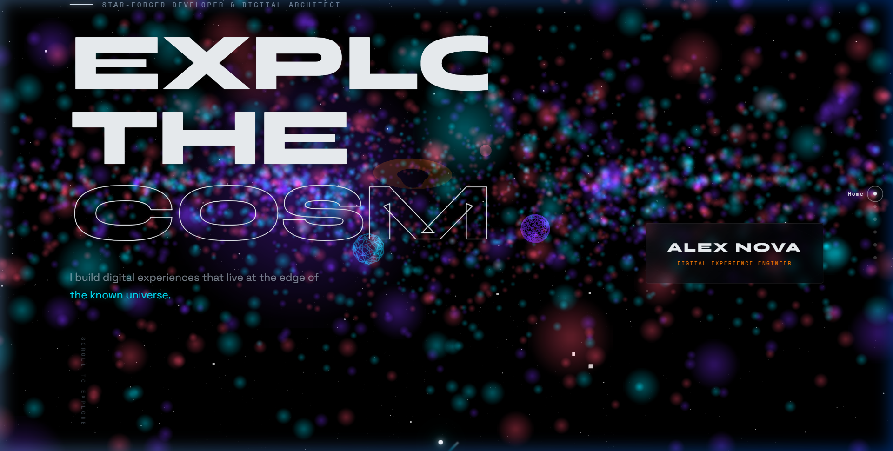
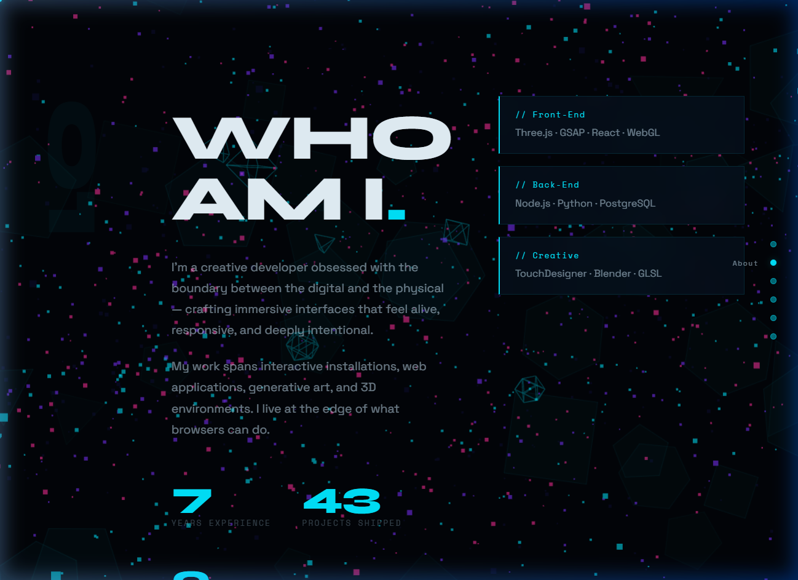
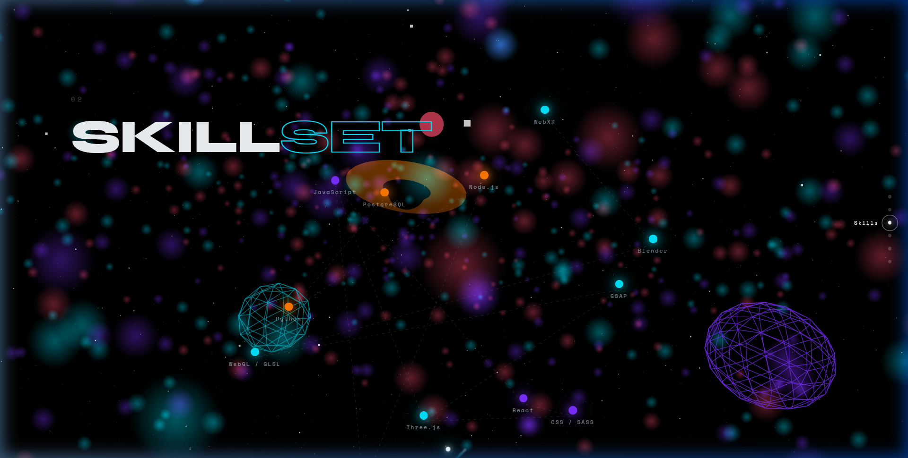
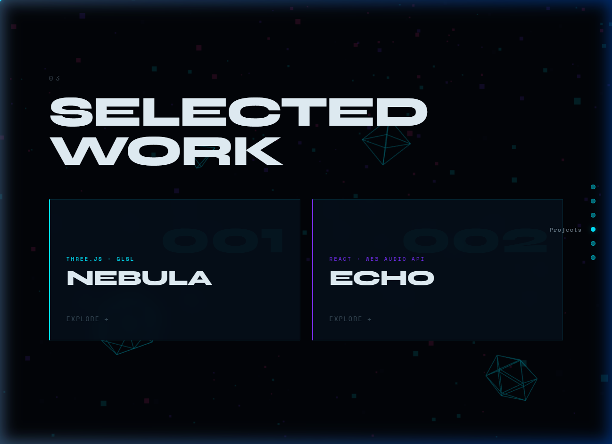
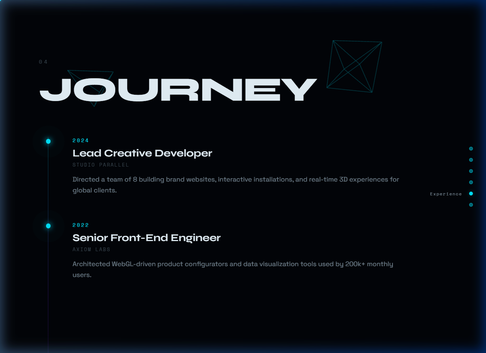
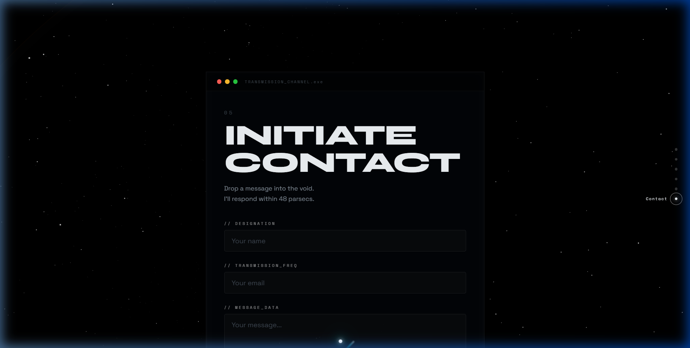

<div align="center">

# ⬡ AXIOM
### *A Cinematic Interactive Portfolio*

<br/>



<br/>

[](https://developer.mozilla.org/en-US/docs/Web/HTML)
[](https://developer.mozilla.org/en-US/docs/Web/CSS)
[](https://developer.mozilla.org/en-US/docs/Web/JavaScript)
[](https://threejs.org/)
[](https://gsap.com/)

<br/>

> **Not a portfolio. An experience.**  
> A fully immersive, scroll-driven digital world built with raw HTML, CSS, and JavaScript — no UI frameworks, no templates.

<br/>

[✦ Live Demo](#) &nbsp;·&nbsp; [✦ View Code](index.html) &nbsp;·&nbsp; [✦ Report Bug](../../issues)

</div>

---

## ✦ What is AXIOM?

AXIOM is a **cinematic interactive portfolio** that behaves like a visual journey rather than a webpage. Scrolling controls the entire narrative — triggering a deep dive towards a supermassive black hole, environment transformations, 3D camera movements, fragmentation effects, and kinetic typography moments.

Designed to feel like a **deep space digital art installation**, every section uses a different immersive technique to tell the story.

---

## ◈ Visual Tour

<table>
<tr>
<td width="50%" align="center">

**01 — Hero**  
Three.js black hole & planets + kinetic type


</td>
<td width="50%" align="center">

**02 — About**  
Geometric fragment canvas + deep space panels



</td>
</tr>
<tr>
<td width="50%" align="center">

**03 — Skills**  
Orbiting constellation network



</td>
<td width="50%" align="center">

**04 — Projects**  
3D-tilt glassmorphic floating tiles



</td>
</tr>
<tr>
<td width="50%" align="center">

**05 — Experience**  
Scroll-activated glowing timeline



</td>
<td width="50%" align="center">

**06 — Contact**  
Futuristic console terminal UI



</td>
</tr>
</table>

---

## ⬡ Animation Systems

| System | Technology | Description |
|--------|-----------|-------------|
| 🌌 **Particle Cosmos** | Three.js | 10,000 stars & 5,000 colored nebula dust particles |
| 🚀 **Shooting Stars** | Three.js | Randomly generated, high-velocity light streaks with long trails |
| 🪐 **Celestial Bodies**| Three.js | Black hole + accretion disk, orbiting planets, and a **Spinning Neutron Star** |
| 📷 **Camera Dive** | Three.js | Z-position dives deep into the black hole on scroll |
| 🌀 **Gravitational Lensing** | Three.js | Camera Field of View (FOV) warps rapidly as you approach the black hole |
| 🖱️ **Mouse Parallax** | GSAP | Holographic badge + camera sway with cursor |
| ✦ **Hero Reveal** | GSAP | Words stagger up from clipping mask on load |
| 🔢 **Counter Animation** | GSAP | Numbers tween to target value when scrolled into view |
| 💎 **Fragment Canvas** | Canvas 2D | Geometric shards dissolve in/out during About section |
| 🕸️ **Skill Constellation** | SVG + DOM | 12 nodes orbit slowly, connected by animated SVG dashlines |
| 🗂️ **3D Project Tiles** | CSS 3D + GSAP | Perspective tilt on hover, per-project color accent |
| 🎬 **Project Modal** | Canvas + GSAP | Cinematic fullscreen overlay with a gravity well particle effect |
| ⏱️ **Timeline Nodes** | GSAP ScrollTrigger | Nodes pulse and glow brightly as they enter the viewport |
| ⚡ **Input Particles** | DOM / GSAP | Micro-burst on contact field focus |
| 💫 **Loading Sequence** | Canvas 2D + GSAP | Particle graph + progress bar + CSS glitch title reveal |
| ☄️ **Comet Cursor** | RAF lerp + Canvas | Velocity-stretched tail with emitting particle sparks |
| 🌀 **Smooth Scroll** | Lenis | 1.4s inertial scroll with custom power easing |

---

## ◈ Tech Stack

```
Three.js  r128        —  3D scenes, particle systems, WebGL renderer
GSAP      3.12.5      —  Animation timelines, ScrollTrigger, all motion
Lenis     1.0.42      —  Buttery smooth inertial scrolling
Canvas 2D (native)    —  Loading screen, fragment effects, modal particles
CSS       (vanilla)   —  Design system, holographic UI, glitch animations
```

**No build tool. No framework. No dependencies beyond the above CDN libraries.**

---

## ◈ Project Structure

```
crater/
├── index.html          ← HTML structure (6 sections + modal + loader)
├── styles.css          ← Full design system & all section styles
├── script.js           ← 12 animation systems (~700 lines)
└── screenshots/        ← Section preview images
    ├── hero.png
    ├── about.png
    ├── skills.png
    ├── projects.png
    ├── experience.png
    └── contact.png
```

---

## ◈ Colour Palette

<table>
<tr>
<td align="center" style="background:#020408; color:#e8f4fc;">

`#020408`  
Background

</td>
<td align="center">

`#00E6FF`  
⬤ Cyan Glow

</td>
<td align="center">

`#7B2FFF`  
⬤ Violet

</td>
<td align="center">

`#FF2D9B`  
⬤ Magenta

</td>
<td align="center">

`#FFD166`  
⬤ Gold

</td>
</tr>
</table>

---

## ◈ Getting Started

No build step required. Just open the file in a modern browser:

```bash
# Clone the repo
git clone https://github.com/YOUR_USERNAME/axiom-portfolio.git

# Open directly in browser
open index.html
# or on Windows:
start index.html
```

> **Recommended:** Use a local server for best performance with Three.js.
> ```bash
> npx serve .
> ```

---

## ✏️ Customisation

Edit these to make it your own:

| What | Where |
|------|-------|
| Your name | `index.html` — `.holo-name` text and `loader-glitch-name` |
| Your role | `index.html` — `.holo-role` and `.eyebrow-text` |
| Bio copy | `index.html` — `#bio-1`, `#bio-2` |
| Skills list | `script.js` — `SKILLS` array (name, level, category) |
| Projects | `script.js` — `PROJECT_DATA` object |
| Timeline | `index.html` — `.timeline-item` blocks |
| Colour palette | `styles.css` — `:root` custom properties |
| Social links | `index.html` — `#link-github`, `#link-linkedin`, `#link-twitter` |

---

## ◈ Performance Notes

- Particle count (`COUNT = 3500`) can be lowered on slower machines
- `devicePixelRatio` is capped at `2` for the WebGL renderer
- Lenis `lagSmoothing` is disabled so GSAP and scroll stay in sync
- All scroll-triggered animations use `requestAnimationFrame` via GSAP ticker

---

## ◈ Browser Support

| Browser | Status |
|---------|--------|
| Chrome 90+ | ✅ Full support |
| Firefox 88+ | ✅ Full support |
| Safari 14+ | ✅ Full support |
| Edge 90+ | ✅ Full support |
| Mobile | ⚠️ Reduced 3D (responsive layout active) |

---

<div align="center">

**Built with obsession. No templates were harmed.**

*© 2024 AXIOM — Interactive Portfolio*

</div>
